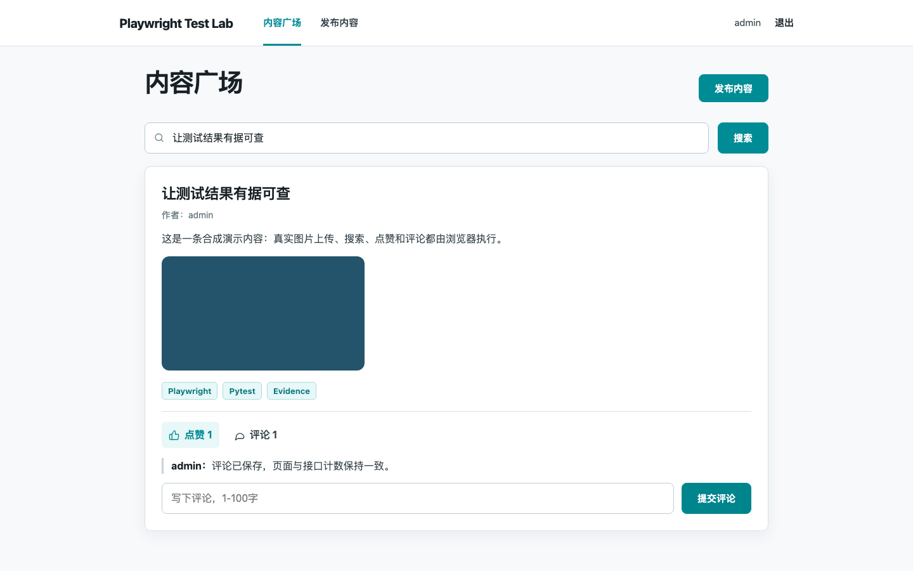

# spec-to-pytest

Turn a scenario into reviewable Python Playwright tests—and keep the evidence behind the result.

**Public preview:** local checks, dependency audits and the initial GitHub Actions workflow pass.
Maintainer review of the latest TRAE run and migrated examples remains open. No production-readiness
or coverage-improvement claim is made.

[中文上手](docs/zh-CN/README.md) · [Architecture](docs/concepts/architecture.md) ·
[TRAE setup](docs/how-to/trae.md) · [Verification status](docs/reference/acceptance-status.md)



## What is included?

- A local FastAPI content community with SQLite state, real image uploads and isolated sessions.
- Maintained Page Objects, workflows, API helpers and Pytest/Allure evidence collection.
- TRAE role instructions, a data-expansion Skill and version-pinned Playwright MCP configuration.
- Checks across case mapping, setup/call/teardown events, JUnit and process exit codes.
- Separate attempts, conservative repair guards and an explicit known-defect demonstration.
- Policy 2.1 structured checks, idempotent requests and separate execution/workflow gates.
  Direct MCP exploration, semantic review and host-delegation review remain explicit.

This project focuses on the boundary between generated candidates and checked execution records.
It uses Playwright, Pytest and Allure; it does not replace them or implement an LLM runtime.

## Start without AI

Prerequisites: Python and uv. See the [observed version matrix](docs/reference/tool-versions.md).
From the repository root on macOS/Linux:

```sh
make setup
make check
AUTO_BASE_URL=http://127.0.0.1:8765 make baseline
```

`setup` installs frozen dependencies and downloads Chromium. The baseline needs no TRAE, separate
Node.js installation, model account or API key. An occupied port is an error, not permission to reuse
or kill another service.

## Three different workflows

| Workflow | Entry point | What it proves |
|---|---|---|
| Maintained baseline | `make baseline` | The local app and framework work together |
| Historical candidate replay | `make replay` | Ported code executes now; not a fresh AI generation |
| New AI-assisted generation | [TRAE guide](docs/how-to/trae.md) | Requires a real host run; not inferred from replay |

```sh
AUTO_BASE_URL=http://127.0.0.1:8765 make replay
AUTO_BASE_URL=http://127.0.0.1:8765 make bug-demo
make report
```

`bug-demo` succeeds only when the selected inner test fails on the injected comment-count defect
with supporting evidence. The inner result stays failed. `report` optionally builds a new local
Allure HTML view and requires the separate Allure CLI; JSON/JUnit evidence does not depend on it.

## Inspect the result

Every run prints its directory under `reports/runs/`. Start with `summary.md` and `manifest.json`;
inspect each attempt's source, collection mapping, events, JUnit and browser artifacts.
The full final acceptance attempt must pass the evidence checks. Failed/blocked outcomes and earlier
repair rounds are retained. Missing cases cannot disappear into a smaller green summary.

Hashes and assertion guards are not an OS sandbox or proof of a correct business oracle.
Run generated code only in a trusted, disposable environment without real credentials; retain the
host's permission controls. Raw traces, screenshots and browser state require review before sharing.
The public-export helper emits only an aggregate allowlist.

## Learn and contribute

- [Architecture and directory ownership](docs/concepts/architecture.md)
- [Troubleshooting](docs/how-to/troubleshooting.md)
- [Structured checks and bounded repairs](docs/how-to/check-contracts.md)
- [Workflow acceptance and maintainer review](docs/how-to/workflow-acceptance.md)
- [Business rules](mana/business_rules.md)
- [Historical sample provenance](examples/candidates/content_lifecycle/README.md)
- [Contribution guide](CONTRIBUTING.md)
- [Source attribution](docs/reference/provenance.md)
- [Approved design](docs/superpowers/specs/2026-09-03-spec-to-pytest-v0.1-design.md)

Parallel workers, public deployment, Docker/Jenkins delivery and additional AI hosts are not v0.1
support claims. The source is available under the [MIT License](LICENSE). See
[Unreleased changes](CHANGELOG.md).
